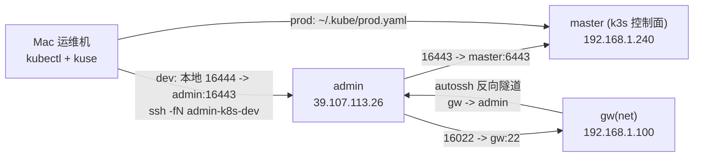

# Insightful Dev 运维说明

本目录用于维护 `gw <-> admin` 反向隧道与 K3s 管理通道，以及 Mac 本机直管集群的操作基线。

## 1. 拓扑与职责

- `admin`（公网运维入口）: `39.107.113.26`
- `gw`（内网网关）: `192.168.1.100`（hostname: `net`）
- `master`（k3s 控制面）: `192.168.1.240`
- 架构原则:
- 集群管理权限在 `admin/Mac kubeconfig`，不在 `gw`。
- `gw` 仅承担网络转发与跳板职责。

### 1.1 Mermaid 拓扑图



## 2. 固定通道

- 反向隧道方向: `gw -> admin`
- `admin:16022 -> gw:22`
- `admin:16443 -> master:6443`

## 3. 执行位置约定

- 在 **Mac 本地** 执行:
- `kuse dev|prod`
- `kubectl ...`
- `ssh -fN admin-k8s-dev`（dev 隧道）
- 在 **admin** 执行:
- `kubectl`（作为兜底入口）
- `ss -lntp | grep -E '16022|16443'`
- 在 **gw** 执行:
- `systemctl/journalctl` 检查 `autossh-admin.service`

## 4. 当前状态（2026-02-28）

- `admin` 侧 `kubectl` 已修复并可用（`v1.35.2`）。
- `admin` 侧 kubeconfig 已指向 `https://127.0.0.1:16443`。
- Mac 已完成免密登录 `admin`（`Host admin-k8s`）。
- Mac 已完成 dev 隧道别名（`Host admin-k8s-dev`，本地 `16444 -> admin:16443`）。
- Mac 已落地环境切换:
- `kuse prod -> ~/.kube/prod.yaml`
- `kuse dev -> ~/.kube/dev.yaml`
- admin 主机名已调整为 `admin`（原 ECS 默认主机名已替换）。

## 4.1 第二步（gw 透明代理）当前进度

- 已完成:
- 在 `gw(192.168.1.100)` 安装 `sing-box 1.12.22`（`/usr/local/bin/sing-box`）。
- 已确认 `gw -> hk2.changuoo.com:35476` TCP/TLS 连通。
- 已确认 VMess 参数以 `vmess://` 解码为准；此前 `EOF` 根因是 UUID 使用错误。
- 当前 `gw` 代理联通验证通过（`mixed :17890`）:
- `curl -x http://127.0.0.1:17890 https://api.ipify.org` 返回 `38.47.106.216`（HK 出口）。
- `registry.k8s.io` 返回 `200`，`registry-1.docker.io` 返回 `401`（可达）。
- `ipset/iptables` 已在 `gw` 落地（透明代理规则链 `K3S_PROXY` 已挂到 `PREROUTING`）:
- `ipset k3s_nodes` 当前配置为 `183.168.1.240/241/242`。
- 放行规则使用 `183.168.1.0/24` 与 `39.107.113.26/32`。
- 未完成（仍待执行）:
- `master/worker` 默认网关尚未灰度切换到 `gw`。
- 保护约束:
- 不能破坏现有管理链路：`admin:16022 -> gw:22`、`admin:16443 -> master:6443`。
- 透明代理规则必须直连内网网段与 `admin(39.107.113.26)`。
- 位置提醒:
- `127.0.0.1:17890` 是 `gw` 本机端口；在 `admin` 上测该地址会失败，属预期。

## 5. Mac 本机直管（推荐）

### 5.1 切换到 prod

```bash
kuse prod
kubectl get nodes -o wide
```

### 5.2 切换到 dev

```bash
# 先确保 dev 隧道在线（不在线就启动）
ssh -fN admin-k8s-dev

kuse dev
kubectl get nodes -o wide
kubectl get pods -A
```

### 5.3 防误操作检查

```bash
echo "$KUBECONFIG"
kubectl config current-context
```

## 6. admin / gw 兜底检查

### 6.1 admin 侧

```bash
ss -lntp | grep -E '16022|16443'
kubectl get nodes -o wide
kubectl get pods -A
```

### 6.2 gw 侧

```bash
sudo systemctl status autossh-admin --no-pager
sudo journalctl -u autossh-admin -n 100 --no-pager
```

## 7. 手册入口

- 团队上手与日常操作手册（新成员必读）: `OPS-TEAM-HANDBOOK.md`
- 个人详细操作与变更日志: `PERSONAL-OPS.md`

## 8. 维护约定（强制）

- 每次运维操作后，必须更新 `PERSONAL-OPS.md` 的“运维日志”。
- 最少记录:
- 日期时间（UTC+8）
- 变更项
- 验证结果
- 回滚点

## 9. 下次继续（透明代理落地）

1. 在 `gw` 复核当前透明代理规则与 `sing-box` 服务状态（已配置但需再验）。
2. 节点改默认网关采用灰度顺序：`worker1 -> worker2 -> master`（每次只改 1 台）。
3. 每台切换后立即验证:
- 节点侧: `curl https://api.ipify.org`、`crictl pull registry.k8s.io/pause:3.10`
- 集群侧: `kubectl get nodes -o wide`、`kubectl get pods -A | grep -E 'ImagePullBackOff|ErrImagePull'`
4. 任一步失败立即回滚该节点默认网关，不并发改动其它节点。
